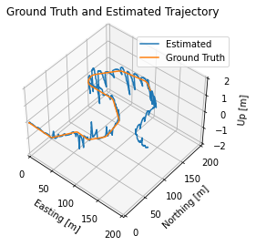

# lab result


## part1: Best state

```python
#補充一些初始值
Q_k = np.eye(6) #到後面記得乘時間的平方
Q_k[0:3, 0:3] *= var_imu_f
Q_k[3:6, 3:6] *= var_imu_w
L_k = np.zeros([9, 6])
L_k[3:6, 0:3], L_k[6:9 ,3:6] = np.eye(3), np.eye(3)

        
#################################################################################
# sensor_var： 传感器方差，用途不明
# p_cov_check:位置信息方差 估计3x3
# y_k: 傳感器得到的數據 3x1
# p_check: position信息 3x1
# v_check: velocity信息 3x1
# q_check: quaternion信息 4x1
################################################################################################
def measurement_update(sensor_var, p_cov_check, y_k, p_check, v_check, q_check):
    # 3.1 Compute Kalman Gain  K = PH(HPH^-1 + MRM^-1)^-1
    H = np.zeros([3, 9])
    H[0:3, 0:3] = np.eye(3)
    R = sensor_var * np.eye(3)
    K = p_cov_check @ H.T @ inv(H @ p_cov_check @ H.T + R)
    
    # 3.2 Compute error state K * delta_y
    delta_x = K @ (y_k - p_check)
    
    # 3.3 Correct predicted state  
    p_hat = p_check + delta_x[0:3]
    v_hat = v_check + delta_x[3:6]
    q_hat = Quaternion(axis_angle=delta_x[6:9]).quat_mult_left(q_check)
    # 3.4 Compute corrected covariance
    p_cov_hat = (np.eye(9) - K @ H) @ p_cov_check 
    
    return p_hat, v_hat, q_hat, p_cov_hat


################################################################################################

for k in range(1, imu_f.data.shape[0]):  # start at 1 b/c we have initial prediction from gt
    delta_t = imu_f.t[k] - imu_f.t[k - 1]
    C_ns = Quaternion(*q_est[k - 1]).to_mat() #兩個參考系之間的rotation matrix
    
    # 1. Update state with IMU inputs
    p_est[k] = p_est[k-1] + delta_t * v_est[k-1] + 0.5 * delta_t ** 2 * (C_ns @ imu_f.data[k-1] + g)
    v_est[k] = v_est[k-1] + delta_t * (C_ns @ imu_f.data[k-1] + g)
    q_est[k] = Quaternion(euler = imu_w.data[k-1] *delta_t).quat_mult_right(q_est[k-1])
    
    # 1.1 Linearize the motion model and compute Jacobians  (狀態轉換矩陣F)
    F_k = np.eye(9)
    F_k[0:3, 3:6] = delta_t * np.eye(3)
    F_k[3:6, 6:9] = - skew_symmetric(C_ns @ imu_f.data[k-1]) * delta_t
    
    # 2. Propagate uncertainty   LQL為測量的誤差矩陣,Qk為常數
    Q = Q_k * delta_t **2
    p_cov[k] = F_k @ p_cov[k-1] @ F_k.T + L_k @ Q @ L_k.T
    
    # 3. Check availability of GNSS and LIDAR measurements
    # gnss.t, gnss.t.shape
    if(np.in1d(imu_f.t[k], gnss.t)):
        index = np.where(gnss.t == imu_f.t[k])[0][0]
        p_est[k], v_est[k], q_est[k], p_cov[k] = measurement_update(var_gnss, p_cov[k], gnss.data[index], p_est[k], v_est[k], q_est[k])

    if(np.in1d(imu_f.t[k], lidar.t)):
        index = np.where(lidar.t == imu_f.t[k])[0][0]
        p_est[k], v_est[k], q_est[k], p_cov[k] = measurement_update(var_lidar, p_cov[k], lidar.data[index], p_est[k], v_est[k], q_est[k])
```

.png)

.png)

## part2: miscalibration

看誤差圖的藍綫數值來具體修改即可

```python
# Incorrect calibration rotation matrix, corresponding to Euler RPY angles (0.05, 0.05, 0.05).
# C_li = np.array([
#       [ 0.9975 , -0.04742,  0.05235],
#       [ 0.04992,  0.99763, -0.04742],
#       [-0.04998,  0.04992,  0.9975 ]
# ])


#part 2 for imitate imu's error -> increase its untrust
# var_imu_f = 0.10
# var_imu_w = 0.25
# var_gnss  = 0.01
# var_lidar = 36
```




## part3: sensor drop out suddenly

適當位置去掉correction的函數作用即可


```python
for k in range(1, imu_f.data.shape[0]):  # start at 1 b/c we have initial prediction from gt
    delta_t = imu_f.t[k] - imu_f.t[k - 1]
    C_ns = Quaternion(*q_est[k - 1]).to_mat() #兩個參考系之間的rotation matrix
    
    # 1. Update state with IMU inputs
    p_est[k] = p_est[k-1] + delta_t * v_est[k-1] + 0.5 * delta_t ** 2 * (C_ns @ imu_f.data[k-1] + g)
    v_est[k] = v_est[k-1] + delta_t * (C_ns @ imu_f.data[k-1] + g)
    q_est[k] = Quaternion(euler = imu_w.data[k-1] *delta_t).quat_mult_right(q_est[k-1])
    
    # 1.1 Linearize the motion model and compute Jacobians  (狀態轉換矩陣F)
    F_k = np.eye(9)
    F_k[0:3, 3:6] = delta_t * np.eye(3)
    F_k[3:6, 6:9] = - skew_symmetric(C_ns @ imu_f.data[k-1]) * delta_t
    
    # 2. Propagate uncertainty   LQL為測量的誤差矩陣,Qk為常數
    Q = Q_k * delta_t **2
    p_cov[k] = F_k @ p_cov[k-1] @ F_k.T + L_k @ Q @ L_k.T
    
    # 3. Check availability of GNSS and LIDAR measurements
    # gnss.t, gnss.t.shape
    # part3测试所有的探测器drop时，需要加入最外层的if条件来模拟
    if k < 0.7 * imu_f.data.shape[0]:
        if(np.in1d(imu_f.t[k], gnss.t)):
            index = np.where(gnss.t == imu_f.t[k])[0][0]
            p_est[k], v_est[k], q_est[k], p_cov[k] = measurement_update(var_gnss, p_cov[k], gnss.data[index], p_est[k], v_est[k], q_est[k])
            
        if(np.in1d(imu_f.t[k], lidar.t)):
            index = np.where(lidar.t == imu_f.t[k])[0][0]
            p_est[k], v_est[k], q_est[k], p_cov[k] = measurement_update(var_lidar, p_cov[k], lidar.data[index], p_est[k], v_est[k], q_est[k])
    # else:
    #     var_gnss  *= 1.01
    #     var_lidar *= 1.01
    # Update states (save)
```

